# Atrium

Living, animated desktop wallpapers for macOS: a reef tank of real fish and corals, drifting nebulae, a turning spiral galaxy, a lava lamp, the real sky above you right now, Earth from orbit with the live ISS, your local weather, and more. It's a small menu bar app written in Swift and SpriteKit, with no dependencies.

There are no prebuilt downloads. Clone it, build it and run it yourself; it takes about a minute.

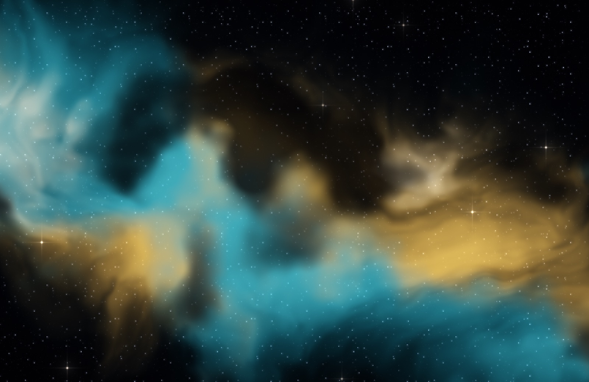

| | |
|---|---|
| 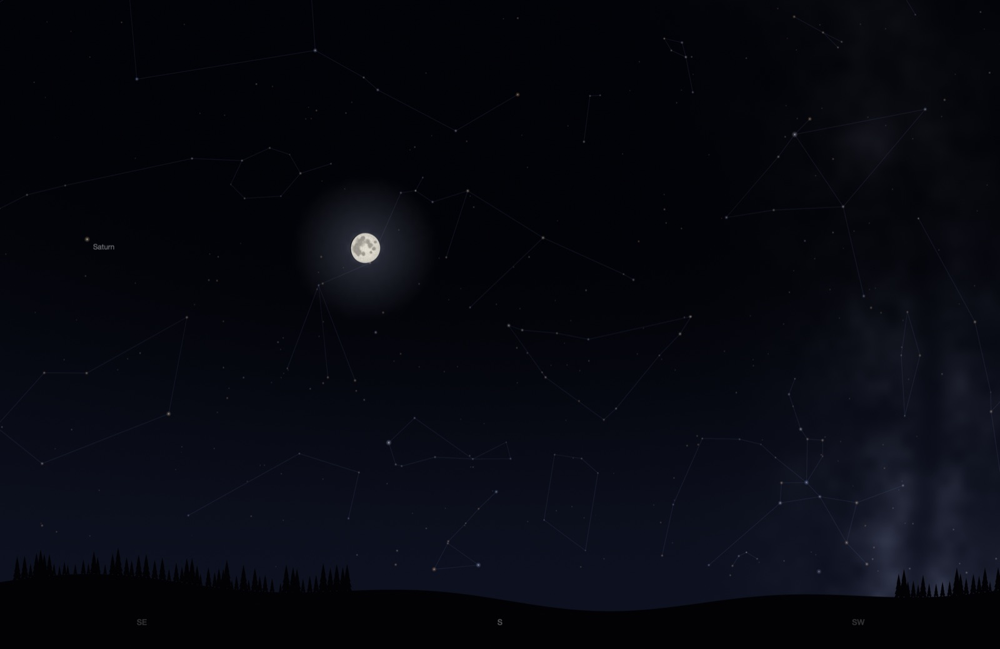 **Live Sky**: tonight's real sky over your location, with the Moon in its true phase, Saturn and the Milky Way | 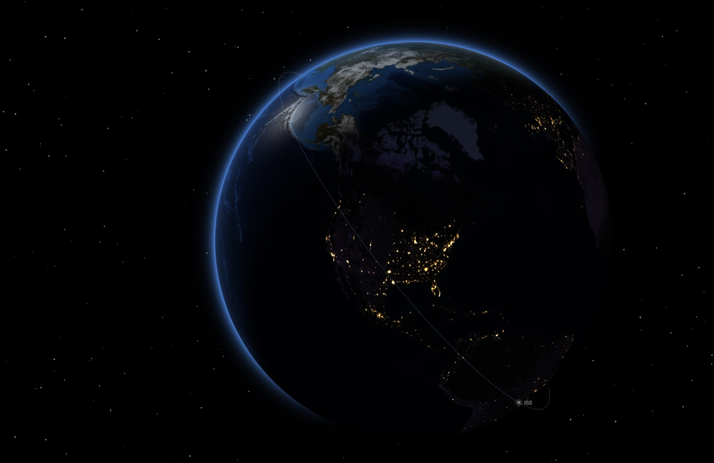 **Earth from Orbit**: city lights on the night side, with the live ISS |
| 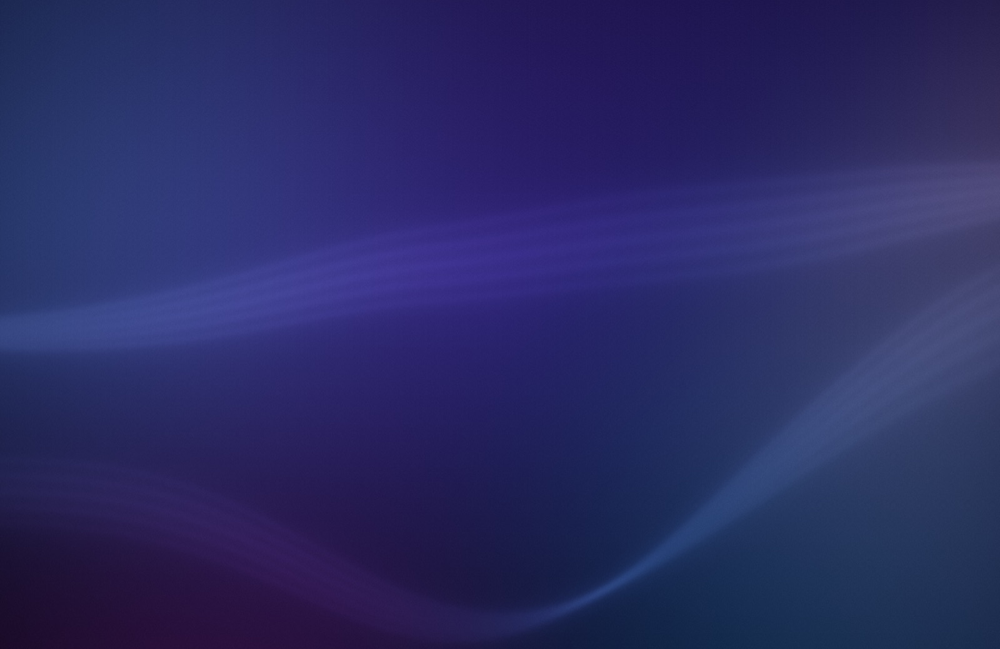 **Flowing Gradient**: soft pools of colour with silk ribbons | 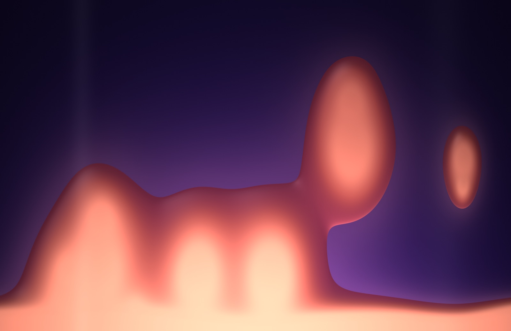 **Lava Lamp**: glowing wax on pinching necks |
| 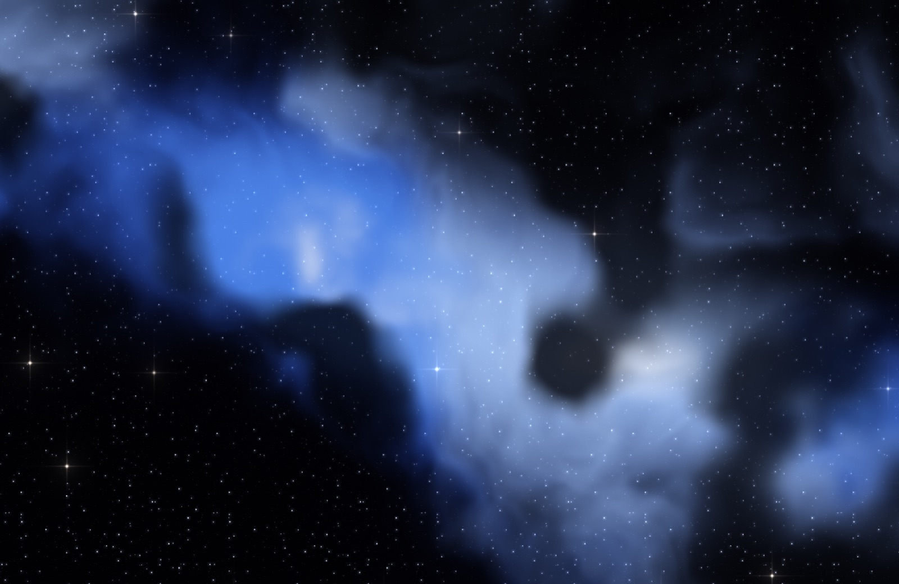 **Nebula**: the Reflection palette | 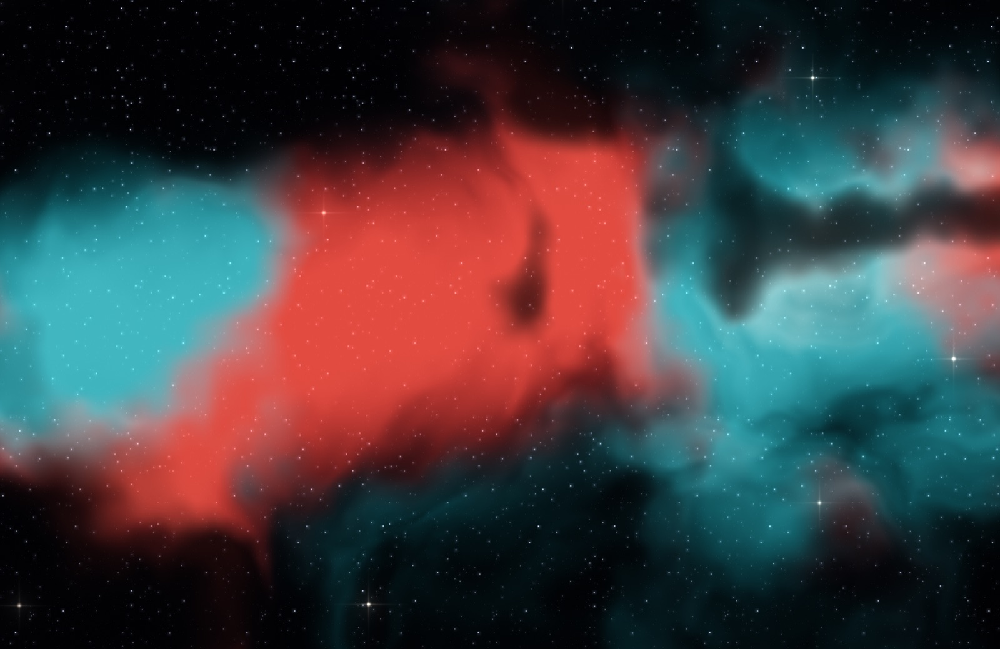 **Nebula**: the Planetary palette |
| 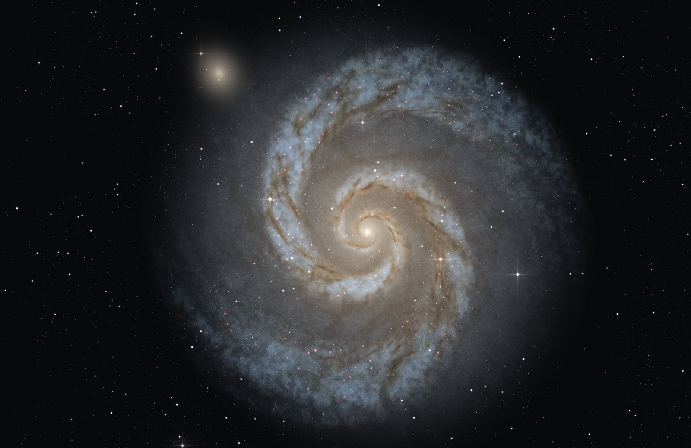 **Galaxy**: the Whirlpool (M51) and its companion, in colours sampled from Hubble's portrait | 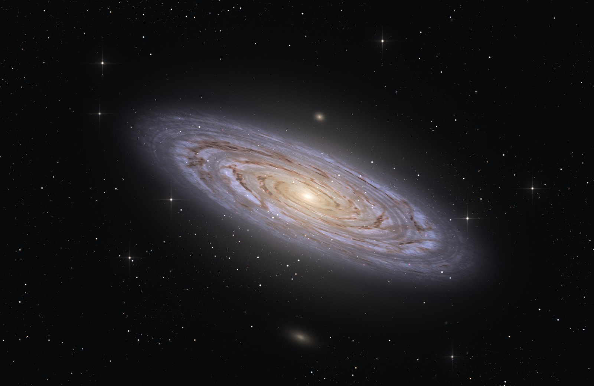 **Galaxy**: Andromeda, steeply tilted, with M32 and M110 beside it |
| 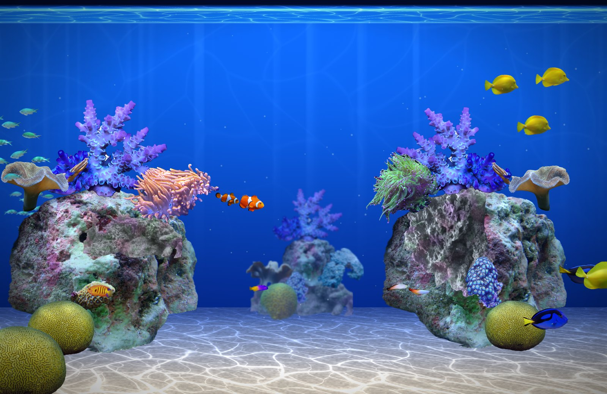 **Fish Tank**: a bright reef of real fish and corals, cut out of photos | 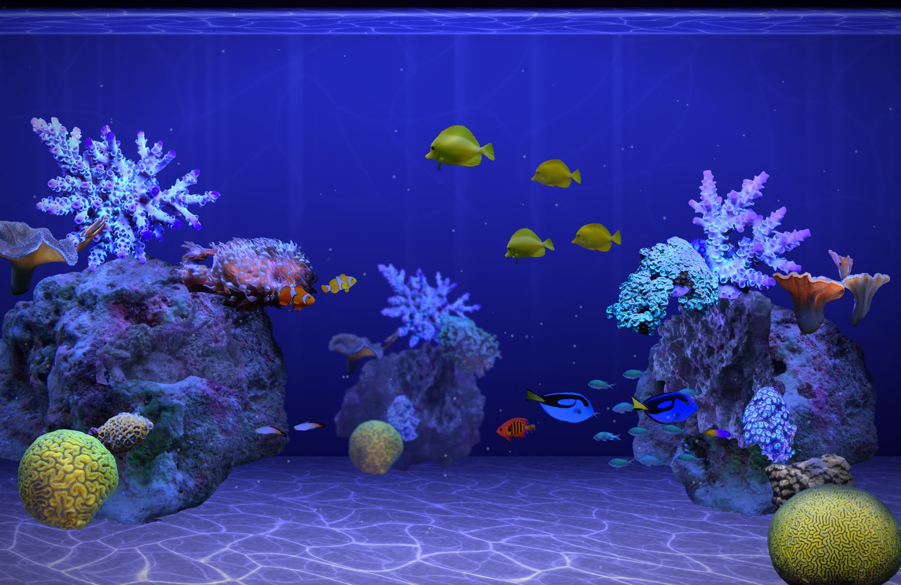 **Fish Tank**: the reef under actinic blue in Dark Mode, its corals fluorescing |
| 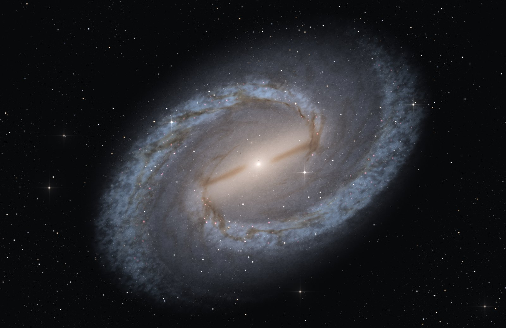 **Galaxy**: NGC 1300, the Great Barred Spiral, with dust lanes along its bar | 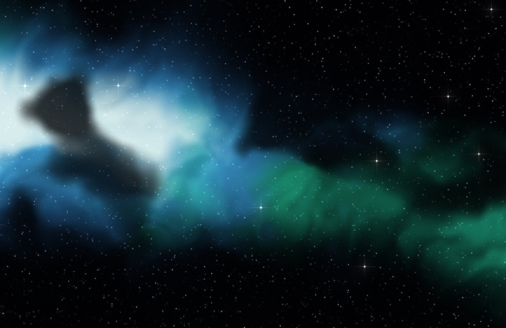 **Nebula**: the Oxygen palette |

*Screenshots show the wallpaper alone, with no desktop icons, menu bar or Dock. Everything moves: the nebulae drift and fold, the galaxies turn, the fish school around the reef, the sky turns, and the ISS crosses the globe. Galaxy, Nebula and the reef are rebuilt differently on every load.*

## How it works

macOS has no public API for third-party live wallpapers. This app gives each display a borderless window at the desktop window level (`CGWindowLevelForKey(.desktopWindow)`). That puts it above the system wallpaper and below your desktop icons, on every Space, and it lets clicks pass straight through to the desktop.

It uses public AppKit and SpriteKit APIs only. It uses no private frameworks, makes no changes to system files, needs no SIP changes and doesn't inject code.

Each wallpaper is a SpriteKit scene. Many are full-screen Metal shaders written as `SKShader`s, and almost everything is drawn in code. The only image files are two NASA Earth textures, a star catalogue, the live cloud map Earth from Orbit downloads, the Fish Tank's fish and corals, cut out of permissively licensed photos, and Weather's hills and Moon.

It's kind to your battery:
- 30 fps on mains power, 15 fps on battery.
- In Low Power Mode it freezes on the current frame.
- Rendering pauses whenever the desktop is fully covered.

Known limits: the lock screen, and the tint of the menu bar and windows, still come from your normal system wallpaper.

## Requirements

- macOS 15 or later. It's developed and tested on macOS 27 on Apple silicon.
- Xcode 16 or later, or its command line tools (Swift 6).

## Build and run

```sh
git clone https://github.com/dtanquary/atrium.git
cd atrium
./build.sh                 # release build → build/Atrium.app
open build/Atrium.app
```

`build.sh` runs `swift build -c release`, wraps the binary in a menu-bar-only `.app` (no Dock icon), copies in the data files, and signs it ad hoc for your own Mac. Move the app into `/Applications` if you like.

Once it's running, use the ✨📺 icon in the menu bar to:
- **Pick** a wallpaper.
- Open **Settings…** (⌘,): a page for each wallpaper, with palettes, sliders and switches that update live.
- Turn on **Open at Login**. macOS may ask you to approve it in System Settings → General → Login Items.
- **Quit**.

To rebuild after pulling changes: `./build.sh && pkill -x Atrium; open build/Atrium.app`

### Permissions and network

- **Location** (optional). Live Sky, Earth from Orbit, Weather and Flowing Gradient's time-of-day mood use your location, and the app asks once. If you decline, it guesses from your time zone.
- **Network.** Weather fetches from [Open-Meteo](https://open-meteo.com) every 15 minutes. Live Sky and Earth from Orbit fetch the ISS position from [wheretheiss.at](https://wheretheiss.at) at most once a minute. Earth from Orbit fetches a global cloud map from [Live Cloud Maps](https://clouds.matteason.co.uk) only once its cached copy is over 3 hours old (1.5 MB when it has changed), and not at all with Live clouds off. For lightning, it asks Open-Meteo for thunderstorms on a grid around you each time the cloud map updates, about every 3 hours. None of them needs an API key.

## The wallpapers

| Wallpaper | What it is |
|---|---|
| Fish Tank | A bright reef tank of real fish and corals, cut out of photos: a chromis school, tangs, clownfish in their anemone, and soft corals swaying |
| Flowing Gradient | Soft pools of colour with silk ribbons that follow the Sun; six palettes and a watercolour Light Mode |
| Lava Lamp | Wax that rises on pinching necks, slumps and sinks; seven jewel-tone palettes, with Light and Dark looks |
| Rain on Glass | Drops sliding down a window over blurred city lights, at night or on an overcast day, in seven palettes |
| Aurora | Northern lights over snowy peaks, shading through real aurora colours |
| Nebula | A unique deep-space cloud on every load, in real nebula colours, dissolving into a new one every few minutes |
| Galaxy | A spiral galaxy turning slowly, after a real one (Whirlpool, Andromeda, the Milky Way and more), with dust lanes, star clusters and pink star-forming knots |
| Live Sky | The real sky above you: stars, planets, the Moon's phase, the Milky Way and the ISS. Deep blue by day. |
| Earth from Orbit | The globe above your location with the live day/night line, today's real clouds, lightning in storms near you, city lights and the ISS |
| Weather | Hills under your live local weather: rain, snow, fog, storms, day and night |
| Pixel City | A pixel-art skyline that follows your clock, with traffic and windows lighting up through the evening |
| Fireflies | Fireflies drifting through a foggy forest at dusk |
| Murmuration | A flock of thousands of starlings over a sunset |
| Campfire | A crackling fire under the stars |
| Game of Life | Conway's cells with fading trails, reseeding so it never dies out |

The docs in [`docs/`](docs/README.md) cover each one in depth: how it works, its settings, cost and ideas for next steps.

## Development

```sh
swift build            # debug build
swift test             # renders every wallpaper offscreen to PNGs and prints each one's per-frame cost
SNAPSHOT_SCENE="Nebula" SNAPSHOT_DIR=/tmp/shots swift test     # one wallpaper
SNAPSHOT_DEFAULTS="gradient.palette=Sunset" SNAPSHOT_APPEARANCE=light swift test   # with settings, in Light Mode
```

- **Tests.** The render test fails if a scene comes out as one flat colour, for example a shader that didn't compile. The astronomy is checked against JPL Horizons, and the weather parser against a real Open-Meteo reply.
- **Adding a wallpaper:** create a file that returns an `SKScene` and add a `Wallpaper` entry in `Sources/Atrium/Scenes.swift`. Its settings are plain data on that entry. [`CLAUDE.md`](CLAUDE.md) covers the scene contract, the ~2 ms per-frame budget, and SpriteKit and shader pitfalls.
- **Layout:**
  - `Sources/Atrium/main.swift`: the app host (windows, menu, power and appearance handling)
  - `Scenes.swift`: the wallpaper list and shared helpers
  - `Settings.swift`: the Settings window
  - one file per wallpaper
  - `Resources/`: data files

## Credits

- Weather data by [Open-Meteo.com](https://open-meteo.com), licensed under [CC BY 4.0](https://creativecommons.org/licenses/by/4.0/).
- ISS positions from the [Where the ISS at?](https://wheretheiss.at) API.
- Stars from the Yale Bright Star Catalogue, 5th edition (Hoffleit & Warren, CDS V/50), public domain.
- Constellation lines from [d3-celestial](https://github.com/ofrohn/d3-celestial) by Olaf Frohn, BSD 3-Clause. Its notice is kept in `Sources/Atrium/Resources/constellations.txt`.
- Earth imagery from NASA's Blue Marble and Black Marble, public domain.
- Clouds from [Live Cloud Maps](https://github.com/matteason/live-cloud-maps) by Matt Eason, CC0. Contains modified EUMETSAT data.
- Planet positions from JPL's [Approximate Positions of the Planets](https://ssd.jpl.nasa.gov/planets/approx_pos.html).
- The Weather wallpaper's hills are a public domain photo of Fort Ord National Monument by the Bureau of Land Management, and its Moon is from NASA's CGI Moon Kit. See [`Sources/Atrium/Resources/weather-credits.tsv`](Sources/Atrium/Resources/weather-credits.tsv).
- Reef fish, corals and rock in the Fish Tank are cut out of public domain, CC0 and CC BY photos from iNaturalist, Wikimedia Commons and NOAA. Each photographer and licence is listed in [`Sources/Atrium/Resources/reef-credits.tsv`](Sources/Atrium/Resources/reef-credits.tsv) and in Settings → About.

## License

[MIT](LICENSE) © 2026 Dave Tanquary
