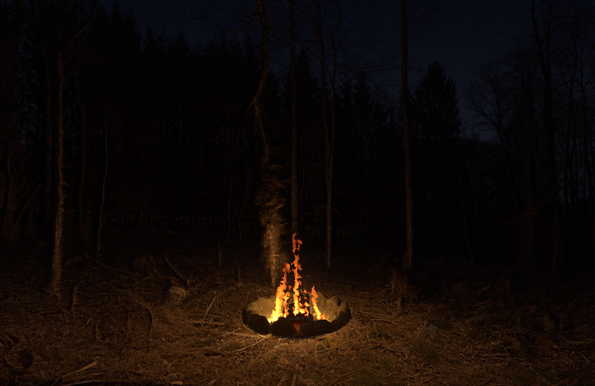
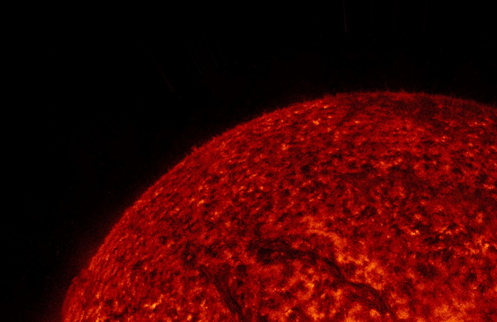
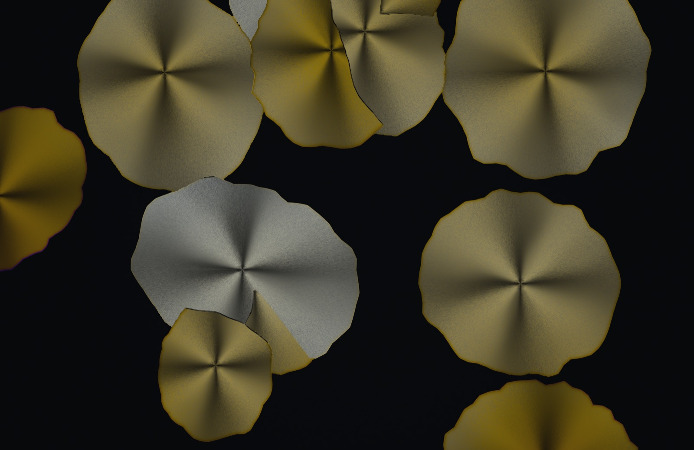
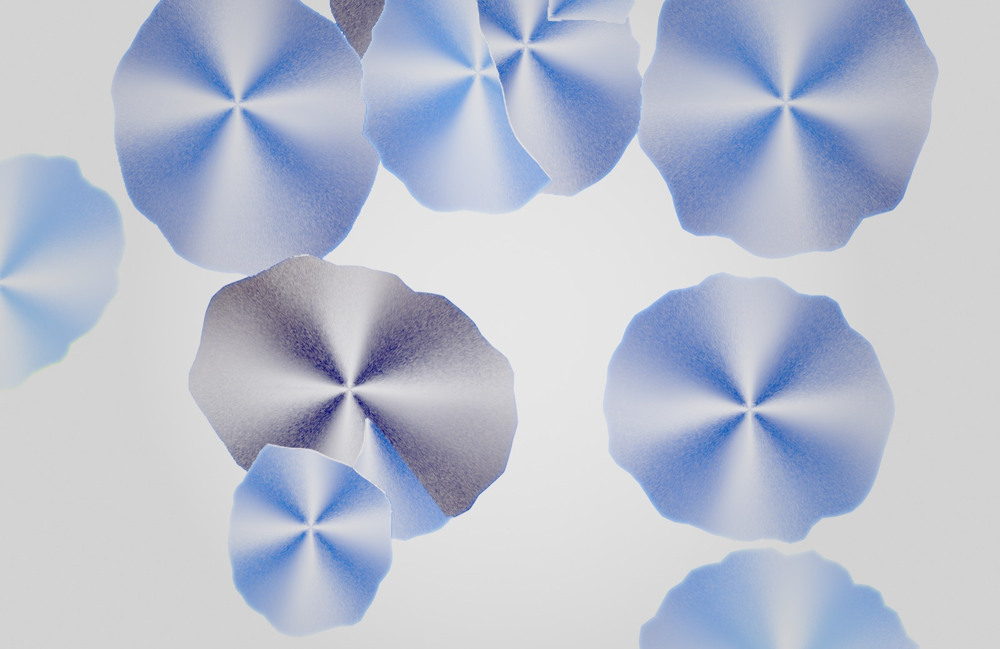

# Atrium

Living, animated desktop wallpapers for macOS: a reef tank of real fish and corals, drifting nebulae, a turning spiral galaxy, a lava lamp, the real sky above you right now, Earth from orbit with the live ISS, your local weather, and more. It's a small menu bar app written in Swift and SpriteKit, with no dependencies.

There are no prebuilt downloads. Clone it, build it and run it yourself; it takes about a minute.

## The wallpapers

Screenshots show the wallpaper alone, with no desktop icons, menu bar or Dock. Everything moves: the fish school, the nebulae drift and fold, the galaxies turn, the sky turns and the starlings wheel. Galaxy, Nebula and the reef are rebuilt differently on every load. The docs in [`docs/`](docs/README.md) cover each wallpaper in depth: how it works, its settings, cost and ideas for next steps.

### Fish Tank
A bright reef tank of real fish and corals, cut out of photos: a chromis school, tangs, clownfish in their anemone, and soft corals swaying.


|  |  |
|---|---|
| By day, in Light Mode | Under actinic blue in Dark Mode, its corals fluorescing |

### Flowing Gradient
Soft pools of colour with silk ribbons that follow the Sun, in six palettes. On Random it drifts from one palette to the next every few minutes.

|  |  |
|---|---|
| In Dark Mode | The watercolour Light Mode |

### Lava Lamp
Wax that rises up the middle as round heads on stems that pinch off, sticks to the top a while, then sinks at the sides, lit by the bulb below. Seven jewel-tone palettes, with Light and Dark looks.

|  |  |
|---|---|
| Coral in Dark Mode | Teal, in Light Mode |

### Rain on Glass
Drops creeping and running down a rainy window, each a tiny lens showing the street upside down. Behind the glass: ten real places, blurred as a camera focused on the glass sees them (from a wet Hamburg square to a cabin in the snow), or city lights in seven palettes. Turn on Follow the weather and the glass does what the weather where you are would do to a real window: rain when it rains, drops drying when it stops, fog on humid mornings, snow melting into beads, and fern frost growing across the pane over hours below freezing.

|  |  |
|---|---|
| Hamburg at night, in Dark Mode | Riomaggiore by day, in Light Mode |
|  |  |
| Following the weather: frost on a freezing night, over the Cabin | Fog on a grey morning, wiped along the runners' tracks |

### Aurora
Northern lights over the snowy Tetons, shading through real aurora colours.

|  |  |
|---|---|
| The classic green | The Purple palette |

### Nebula
A unique deep-space cloud on every load, in real nebula colours, dissolving into a new one every few minutes.

|  |  |
|---|---|
| The Hubble palette | The Reflection palette |
|  |  |
| The Planetary palette | The Oxygen palette |

### Galaxy
A spiral galaxy turning slowly, after a real one, with dust lanes, star clusters and pink star-forming knots.

|  |  |
|---|---|
| The Whirlpool (M51) and its companion, in colours sampled from Hubble's portrait | Andromeda, steeply tilted, with M32 and M110 beside it |
|  |  |
| NGC 1300, the Great Barred Spiral, with dust lanes along its bar | The Milky Way, seen face-on |

### Live Sky
The real sky above you: stars, planets, the Moon's phase, the Milky Way and the ISS. Deep blue by day.

|  |  |
|---|---|
| Tonight's sky, with the Moon in its true phase, Saturn and the Milky Way | Dusk, from Preview a time of day in Settings |

### The Moon
The Moon filling the screen as it is right now from where you are: its real phase, wobble and tilt, from NASA's LRO maps, with shadows along the terminator, earthshine on the dark side, and copper during a lunar eclipse. Choose black, faint real stars or the real sky behind it.

|  |  |
|---|---|
| A waxing crescent with earthshine, among the real stars | The morning Moon on the Sky backdrop, its dark side the sky's own blue |
|  |  |
| The total lunar eclipse of 31 December 2028, previewed | Checked against NASA's Dial-a-Moon (left of each pair) for phase, libration, tilt and tone |

### Earth from Orbit
The globe above your location with the live day/night line, today's real clouds, lightning in storms near you, city lights and the ISS.

|  |  |
|---|---|
| City lights on the night side, with the live ISS | The day side, under today's real clouds |

### Weather
Real hills under your live local weather, beneath a physical sky with the real Sun and Moon: sunrise and twilight, real clouds on the real wind, rain, snow lying on the ground, valley mist and lightning.

|  |  |
|---|---|
| A fair morning, with real clouds drifting on the wind | Sunset from a physical sky, the hills gone to silhouettes |
|  |  |
| Fog, with mist lying in the valley | Snow falling, and lying on the hills |

### Pixel City
A pixel-art skyline that follows your clock, with traffic and windows lighting up through the evening.

|  |  |
|---|---|
| Dusk, the windows coming on | Late at night, under the Moon |

### Fireflies
Fireflies drifting over a misty meadow at blue hour.


### Murmuration
Tens of thousands of starlings wheeling over Brighton's West Pier or a marsh pond, flying like the real thing (a published flight model), mirrored in the water and scattering from a falcon. By default a whole evening plays out, from golden hour to the roost.


|  |  |
|---|---|
| The marsh pond in the afterglow | The West Pier at blue hour |

### Campfire
A campfire in a stone ring in a real forest clearing at night, its flames simulated, lighting the stones, ground and nearby trees as it flickers, under the real stars.



### Game of Life
Conway's cells, reseeding so they never die out. The Calm look shows a long exposure, so cells melt into soft glowing blobs that drift slowly; the Classic look is crisp, quick and colourful.

|  |  |
|---|---|
| Calm | Classic |

### Turing Patterns
Reaction–diffusion, the chemistry Alan Turing proposed for how animals get their spots and stripes. Patterns grow from a few glowing seeds, then slowly drift from coral to dividing spots to a honeycomb to fingerprint stripes and round again, in six jewel-tone palettes. Patches keep dissolving and growing back in, so it never stops moving, or it can swirl on a slow current instead.

|  |  |
|---|---|
| Fingerprint stripes in Dark Mode | Coral, glazed like ceramic, in Light Mode |

### The Sun Today
The real Sun as NASA's Solar Dynamics Observatory saw it within the last hour or so: today's flares, sunspots and prominences, in eight wavelengths, each in its real SDO colour, from the gold coronal loops of 171 Å to visible light. It shimmers gently at the edge, or plays a time-lapse of the last three hours.

|  |  |
|---|---|
| 193 Å, the million-degree corona, on 27 September 2026 | 304 Å, the chromosphere, in the close-up framing |

### Crystals
Vitamin C crystallising on a microscope slide between polarisers: round spherulites and fans of fibres grow out of the dark liquid, each with a dark cross, then melt away and grow again in a new pattern every few minutes. The colours are physics, not a palette: the interference colours of the Michel-Lévy chart, computed for each crystal's thickness. Light Mode turns the polarisers parallel, so the same crystals show the complementary colours on white.

|  |  |
|---|---|
| First-order straw and gold, in Dark Mode | The same slide in Light Mode, between parallel polarisers |

### Wind
The live wind around you as thin streaks streaming across the map, in the spirit of the hint.fm wind map and earth.nullschool: a grid of Open-Meteo's hourly forecast, blended from hour to hour, with streaks that speed up, brighten and curl with the real wind, as brush strokes like hint.fm's or comets like nullschool's. Zoom from your town to half the continent, over Natural Earth's coastlines, its shaded relief, or nothing, in six jewel-toned palettes. Light Mode draws the same streaks as ink on paper.

|  |  |
|---|---|
| Half the continent, over shaded relief | The same in Light Mode |

### Dappled Light
Sunlight through a tree onto a warm white plaster wall, from the real Sun where you are: it only falls when the Sun is on the wall's side, and turns golden near sunset. Every gap between the leaves is a pinhole camera, so the dapples are images of the Sun, round or stretched by the angle of the light, and crescents during a real solar eclipse. Near leaves cast sharp shadows, far ones melt into soft shade. Cloud softens it and wind sways the leaves, from the live weather; at night, faint moonlight at the real phase, or a warm streetlight. In Dark Mode the same light falls on charcoal plaster.

|  |  |
|---|---|
| A clear afternoon on a south-west wall | Twenty-five minutes before sunset |
|  |  |
| Dark Mode: the same light on charcoal plaster | A partial solar eclipse: every dapple a crescent |

## How it works

macOS has no public API for third-party live wallpapers. This app gives each display a borderless window at the desktop window level (`CGWindowLevelForKey(.desktopWindow)`). That puts it above the system wallpaper and below your desktop icons, on every Space, and it lets clicks pass straight through to the desktop.

It uses public AppKit and SpriteKit APIs only. It uses no private frameworks, makes no changes to system files, needs no SIP changes and doesn't inject code.

Each wallpaper is a SpriteKit scene. Many are full-screen Metal shaders written as `SKShader`s, and almost everything is drawn in code. The only image files are two NASA Earth textures, a star catalogue, the live cloud map Earth from Orbit downloads, the Sun images The Sun Today downloads, the Fish Tank's fish and corals and Weather's hills and clouds, all cut out of permissively licensed photos, and the Moon's colour and heights, for Weather and The Moon.

It's kind to your battery:
- 60 fps on mains power, 30 fps on battery.
- In Low Power Mode it freezes on the current frame.
- Rendering pauses whenever the desktop is fully covered.
- Settings → Power changes each of these rates (Freeze, 15, 30 or 60 fps). For a demo on battery, choose Full Speed on Battery in the menu bar.

Known limits: the lock screen, and the tint of the menu bar and windows, still come from your normal system wallpaper.

## Requirements

- macOS 15 or later. It's developed and tested on macOS 27 on Apple silicon.
- Xcode 16 or later, or its command line tools (Swift 6).

## Build and run

```sh
git clone https://github.com/dtanquary/atrium.git
cd atrium
./build.sh                 # release build → build/Atrium.app
open build/Atrium.app
```

`build.sh` runs `swift build -c release`, wraps the binary in a menu-bar-only `.app` (no Dock icon), copies in the data files, and signs it ad hoc for your own Mac. Move the app into `/Applications` if you like.

Once it's running, use the ✨📺 icon in the menu bar to:
- **Pick** a wallpaper.
- Turn on **Shuffle** to move on to a random wallpaper every so often, and choose **Next Wallpaper** to skip ahead. Settings → General sets how often (every 5 minutes to every day) and which wallpapers take part.
- Open **Settings…** (⌘,): a page for each wallpaper, with palettes, sliders and switches that update live, plus General, Power and About.
- Turn on **Open at Login**, here or in Settings → General. macOS may ask you to approve it in System Settings → General → Login Items.
- **Quit**.

To rebuild after pulling changes: `./build.sh && pkill -x Atrium; open build/Atrium.app`

### Permissions and network

- **Location** (optional). Live Sky, Earth from Orbit, Weather and Flowing Gradient's time-of-day mood use your location, and the app asks once. If you decline, it guesses from your time zone.
- **Network.** Weather and Dappled Light fetch from [Open-Meteo](https://open-meteo.com) every 15 minutes, sharing one request. Live Sky and Earth from Orbit fetch the ISS position from [wheretheiss.at](https://wheretheiss.at) at most once a minute. Earth from Orbit fetches a global cloud map from [Live Cloud Maps](https://clouds.matteason.co.uk) only once its cached copy is over 3 hours old (1.5 MB when it has changed), and not at all with Live clouds off. For lightning, it asks Open-Meteo for thunderstorms on a grid around you each time the cloud map updates, about every 3 hours. The Sun Today fetches SDO images from [Helioviewer](https://helioviewer.org) at most every 15 minutes (2048 pixels, 0.3–0.5 MB) or 30 (4096, 1–2 MB, for the close-up), keeping the last few hours on disk. None of them needs an API key.
- **Wind** uses your location too, and asks Open-Meteo for the hourly wind forecast at 384 points around you every two hours, for the zoom on screen (about 230 KB and 384 of Open-Meteo's free 10,000 calls a day each time, so at most 4,600 a day). The last reply for each zoom stays on disk, so it works offline.

## Development

```sh
swift build            # debug build
swift test             # renders every wallpaper offscreen to PNGs and prints each one's per-frame cost
SNAPSHOT_SCENE="Nebula" SNAPSHOT_DIR=/tmp/shots swift test     # one wallpaper
SNAPSHOT_DEFAULTS="gradient.palette=Sunset" SNAPSHOT_APPEARANCE=light swift test   # with settings, in Light Mode
SNAPSHOT_SCENE="Fish Tank" SNAPSHOT_MOVIE=6 swift test       # then 6 seconds of frames at 15 fps, for a GIF
```

- **Tests.** The render test fails if a scene comes out as one flat colour, for example a shader that didn't compile. The astronomy is checked against JPL Horizons, and the weather parser against a real Open-Meteo reply.
- **Adding a wallpaper:** create a file that returns an `SKScene` and add a `Wallpaper` entry in `Sources/Atrium/Scenes.swift`. Its settings are plain data on that entry. [`CLAUDE.md`](CLAUDE.md) covers the scene contract, the ~2 ms per-frame budget, and SpriteKit and shader pitfalls.
- **Layout:**
  - `Sources/Atrium/main.swift`: the app host (windows, menu, power and appearance handling)
  - `Scenes.swift`: the wallpaper list and shared helpers
  - `Settings.swift`: the Settings window
  - one file per wallpaper
  - `Resources/`: data files

## Credits

- Weather data by [Open-Meteo.com](https://open-meteo.com), licensed under [CC BY 4.0](https://creativecommons.org/licenses/by/4.0/).
- ISS positions from the [Where the ISS at?](https://wheretheiss.at) API.
- Stars from the Yale Bright Star Catalogue, 5th edition (Hoffleit & Warren, CDS V/50), public domain.
- Constellation lines from [d3-celestial](https://github.com/ofrohn/d3-celestial) by Olaf Frohn, BSD 3-Clause. Its notice is kept in `Sources/Atrium/Resources/constellations.txt`.
- Earth imagery from NASA's Blue Marble and Black Marble, public domain.
- Clouds from [Live Cloud Maps](https://github.com/matteason/live-cloud-maps) by Matt Eason, CC0. Contains modified EUMETSAT data.
- The Wind wallpaper's coastlines, lakes and shaded relief are from [Natural Earth](https://www.naturalearthdata.com), public domain.
- The Moon's maps are from NASA's [CGI Moon Kit](https://svs.gsfc.nasa.gov/4720) (Ernie Wright, NASA Scientific Visualization Studio), public domain: LROC colour and LOLA heights from the Lunar Reconnaissance Orbiter.
- Planet positions from JPL's [Approximate Positions of the Planets](https://ssd.jpl.nasa.gov/planets/approx_pos.html).
- Images of the Sun courtesy of NASA/SDO and the AIA, EVE, and HMI science teams ([terms](https://sdo.gsfc.nasa.gov/data/rules.php)), via the ESA/NASA [Helioviewer Project](https://helioviewer.org).
- The Weather wallpaper's hills are a public domain photo of Fort Ord National Monument by the Bureau of Land Management, its clouds are cut out of CC0 photos from Poly Haven and Wikimedia Commons, and its Moon is from NASA's CGI Moon Kit. See [`Sources/Atrium/Resources/weather-credits.tsv`](Sources/Atrium/Resources/weather-credits.tsv) and Settings → About.
- The Aurora wallpaper's mountains are a public domain National Park Service photo of the Tetons in winter by A. Falgoust ([source](https://commons.wikimedia.org/wiki/File:Teton_Point_Turnout_in_Winter_(52098766554).jpg)).
- The Murmuration wallpaper's grounds are "Tide bears the last glow - Brighton, UK" by sagesolar, CC BY 4.0 ([source](https://commons.wikimedia.org/wiki/File:Tide_bears_the_last_glow_-_Brighton,_UK.jpg)), with its sky cut away and its sea relit, and a public domain U.S. Fish and Wildlife Service photo of a tundra pond ([source](https://commons.wikimedia.org/wiki/File:Sunset_over_a_tundra_pond_(53708107535).jpg)).
- The Fireflies wallpaper's meadow is "Field at dusk" by Tristan Ferne, CC BY 2.0 ([source](https://www.flickr.com/photos/89056504@N00/7357684410)), with its sky cut away and relit for blue hour. See [`Sources/Atrium/Resources/fireflies-credits.tsv`](Sources/Atrium/Resources/fireflies-credits.tsv).
- The Campfire wallpaper's clearing is the CC0 panorama "Hochsal Forest" by Adrian Kubasa ([source](https://polyhaven.com/a/hochsal_forest)), relit by the fire, with CC0 scans of a stone fire pit by Sebastian Platen and dry branches by Rico Cilliers from Poly Haven. See [`Sources/Atrium/Resources/campfire-credits.tsv`](Sources/Atrium/Resources/campfire-credits.tsv).
- The Rain on Glass backdrops are CC0 HDRIs from Poly Haven by Greg Zaal, Rico Cilliers, Alexander Scholten, Andreas Mischok and Oliksiy Yakovlyev, public domain photos from the National Park Service and USFWS, and CC BY photos from Wikimedia Commons by Douglas Paul Perkins, mariemon, epSos.de and Vyacheslav Argenberg. See [`Sources/Atrium/Resources/rain-credits.tsv`](Sources/Atrium/Resources/rain-credits.tsv) and Settings → About.
- Reef fish, corals and rock in the Fish Tank are cut out of public domain, CC0 and CC BY photos from iNaturalist, Wikimedia Commons and NOAA. Each photographer and licence is listed in [`Sources/Atrium/Resources/reef-credits.tsv`](Sources/Atrium/Resources/reef-credits.tsv) and in Settings → About.

## License

[MIT](LICENSE) © 2026 Dave Tanquary
