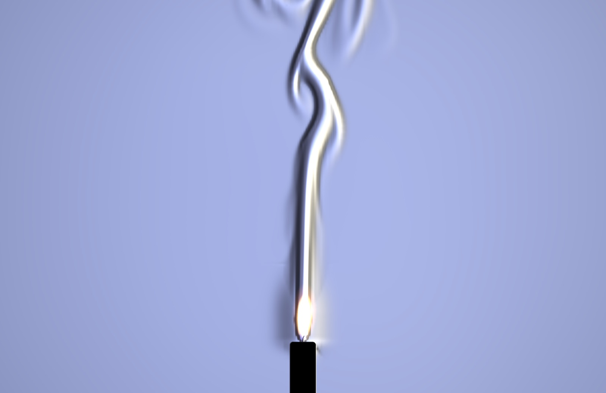

# Schlieren

Rising heat as a colour schlieren camera sees it, after the photos of Gary Settles (Penn State), Andrew Davidhazy (RIT) and Ted Kinsman (RIT). Warm air is thinner than the air around it, so it bends light slightly. A schlieren camera focuses its light source onto a colour filter, the "cutoff", so each point of the picture takes whatever colour the filter has where that point's rays were bent to. The two edges of a plume bend light opposite ways, so they come out in opposite colours, and the air the heat hasn't touched shows the filter's centre. Candles, a mug of coffee or a radiator heat a simulated room. The flames are drawn in their own colour on top, since they give off their own light, and the objects are black silhouettes, each edge wrapped in a thin coloured fringe.

- **Files:** `Sources/Atrium/Schlieren.swift` holds the `Schlieren` scene, its shader, the filter table and `AirSim`. `frameTime` comes from Fireflies.swift, and `rgb` and `paint` come from Fireflies.swift and Scenes.swift.
- **Entry:** `@MainActor func schlieren(size:)`. Registry entry: icon `heat.waves`, tint `.pink`, palettes under `schlieren.palette`.
- **Kind:** a CPU fluid simulation feeding an `SKMutableTexture`, and one full-screen shader sprite that turns it into a schlieren image, plus additive sprites for the flames.

| Rainbow filter, Spectrum palette (after Davidhazy) | Knife edge, Pastel, Light Mode (after Kinsman) |
|---|---|
|  |  |

## How it works
1. **Optics.**
   - A ray through warm air turns toward cooler, denser air by ε = ∇φ, where φ = ∫(n − n0) dz is the extra optical path along the line of sight.
   - Gladstone–Dale gives n − n0 = −(n0 − 1)(1 − T0/T) at constant pressure, with n0 − 1 = 2.72e-4 at 20 °C (2.93e-4 is the 0 °C figure).
   - The sim is a 2D slice, so φ ≈ (n0 − 1)·depth·(T0/T − 1), where `depth` is how much hot air a ray crosses (`sources`).
   - The source's image slides across the filter by Δ = f·ε. The shader works in filter half-widths: a bend of `span` µrad reaches the filter's outer colours. That's `u_gain` = (n0 − 1)·depth / span / cell, applied to the difference of T0/T between neighbouring fine cells.
   - Air's own dispersion is 1–2% across the visible, so all the colour comes from the filter.
2. **Filters** (`filterTable`). A pixel's colour is ∫ S(p)·F(p + Δ) dp: the filter F averaged over the source's image S as the bend slides it across. That's baked on the CPU into a 128×128 table over ±2 half-widths, and the shader does one lookup.
   - The source's image is a slit (24 samples, 0.24 half-widths wide) for the strips and knife edge, and a disc (48 golden-angle samples, radius 0.13) for the dark field. Its size is what softens every hue boundary into a ramp, as in the photos.
   - The bands end in an opaque holder, so their strongest bends go black, as in Settles' tricolour photo. The rainbow's and the dark field's outer colours run on to the table's edge. Round the flames in Davidhazy's and Settles' photos the colour saturates rather than going black, and a first version that blacked them out looked wrong beside them.
   - Each filter has its own gain (`filterGain`: dark field 1, rainbow 2, bands 1.6, knife edge 1), for its rig as set in the photos. The rainbow and band shots run their plumes out to the outer colours; the dark field and knife edge keep them softer.

   | Filter | Background | What it shows | After |
   |---|---|---|---|
   | Dark field (default) | black | a round stop ringed by the left colours on the left and the right colours on the right; brightness grows with the bend, so plumes glow on black, and the outer colours run on | Settles' candle bands, his teakettle |
   | Rainbow | the centre colour | a continuous strip through all five colours, its ends running on; colour tracks the sideways bend | Davidhazy's four candles, Howes' and Greenberg's continuous filters |
   | Bands | the centre colour | coloured strips (0.3 and 0.9 half-widths), with the thin dark gaps between an LED's dies | Settles' red-field candle (a tricolour LED at the source, a slit at the cutoff) |
   | Knife edge | the centre colour | a knife edge graded from shade to clear: relief, lit from one side, tinted by the palette | Kinsman's pastel candles, Settles' sepia transition photo |

3. **Palettes.** Five colours from one side of the filter to the other: far left, left, centre, right, far right. Four are after named photos (Candlelight: Settles' dark bands; Spectrum: Davidhazy; Tricolour: Settles' red field; Pastel: Kinsman; Ember: Settles' kettle), three are jewel tones. Light Mode lifts the centre colour 55% toward white for the bright-field filters, which is how Kinsman's photos look. The dark field stays dark.
4. **The air** (`AirSim`).
   - Velocity runs on a coarse grid, 64 rows for the frame plus 8 above it, so plumes leave the picture before they meet the sim's edge. That's 99×72 at 16:10. It uses FlameSim's scheme (Stam's stable fluids, red-black SOR with 16 iterations, vorticity confinement), with its own sources and boundaries.
   - Vorticity confinement is 5. At 2 a single taper stayed a smooth column to the top of the frame. At 5 it kinks and starts to billow in the upper third, as Settles' still-air photo does.
   - Temperature, θ = ΔT/T0, runs on a grid three times finer (297×216) by MacCormack advection (Selle et al. 2008), limited to the cells it read so it can't overshoot. Schlieren is a derivative, so numerical diffusion erases exactly the thin edges it shows. A plain semi-Lagrangian field lost them.
   - Buoyancy is g·θ/(1 + θ), against the room's mean. The edges are open: pressure 0 past them, with velocity copied into the ghost ring. Open edges let a drift of the whole field build up, which went unstable within 10 s of sim time in the prototype. So the mean velocity is removed every step, as in a still room.
   - A 2D slice can't spread heat sideways in depth, as a real plume does. Drag (1.2/s), cooling (1/s, 0.35 for the radiator) and a little diffusion (3e-5 m²/s, explicit, in as many passes as keep it under 0.25 a pass) stand in for it, so plumes don't accelerate forever.
   - Flame gas above θ 0.8 is quenched toward it at 12/s. Gas hundreds of degrees hotter than the plume mixes down within a couple of centimetres (θ ≈ 1 by the tip, NIST). Without it, a thin thread of flame-hot gas rose through each plume and drew it as narrow ribbons cycling through every colour, where the photos show broad, smooth bands.
   - A draft drifts back and forth, a little differently at each height (two sines over time plus a shear wave 25 rad/m tall). That sets plumes swaying and kinks them into curls and turbulence, as room air does. Without it a single candle stayed laminar to the top of the frame.
   - Room air comes in at the bottom and sides, and at the top the air leaves as it is.
5. **Heat sources** (`build`). Sizes are real:
   - **Candles:** four birthday candles 6.4 mm across, with 6×16 mm flames, in a 0.13 m frame, about Davidhazy's.
   - **Candle:** one 21 mm taper (NIST's, with a 42 mm flame; ours is 34 mm tall) in a 0.32 m frame.
   - **Mug:** 84 mm across and 95 mm tall, in a 0.34 m frame. Its coffee surface, just below the rim, is at θ 0.15 (about 70 °C). Its walls are at 0.05 in a 2 mm layer; at 0.1 and 4 mm they glowed far brighter than Kinsman's thin halo.
   - **Warm air:** a radiator along the bottom with five hotter patches at θ 0.2.

   - A flame is `stamp`ed each step from a table made once. It's a teardrop of gas at θ 3 (about 1150 K). Above it sits the first 2.5 flame heights of its plume: a Gaussian across, starting half a flame wide at the flame's middle and widening 0.3 m per metre, with θ = 1.1/(1 + 2.5z/height), fading to nothing at the cone's top and just below the flame. That gives the V the photos show at the base. A round halo round the flame instead made a bulb wider than the plume above it, which no photo shows.
   - Warm patches (the mug, the radiator) are drawn each step, since they ripple. Their heat comes off in a few wandering spots (two sines across them) rather than evenly, so a mug sheds several columns.
   - `span` per source follows the research: candles saturate a 100–300 µrad filter near the flame, while a mug's plume bends light a tenth as much, so its rig is more sensitive.
6. **Shader.**
   - The bend is a central difference of T0/T (16 bits in red and green, linear filtering) at ±1 fine texel. That's a bilinear interpolation of the cell differences, so it's continuous.
   - **Eddies.** The sim's cells are about 3 mm, so eddies finer than that are added as a small warp of where the field is read: two octaves of value noise at 28 per frame height, up to 3 fine cells, rising with the plume at 0.4 m/s of sim time (`u_air`). It fades in from 40% to 85% of the height, so the laminar stem stays smooth and the turbulent crown gets the crinkled edges of the photos.
   - Faint, slow mottling (value noise, 0.05 half-widths) stands for room air that's never quite still.
   - A small random tilt of the bend across the frame stands for a cutoff that isn't quite at focus. It shows as the navy-to-black drift in Settles' dark photo.
   - Objects come from a silhouette mask (`paint`, 1 px per point). The mask's own gradient is added as a strong bend, so each edge wears the filter's outer colour on its side: the thin fringe round every silhouette in the photos.
   - The round mirror option adds a black surround, a soft rim that bends light outward, and a vignette.
   - A little shadowgraph comes from the Laplacian: slight defocus turns curvature into light and shade.
   - Then the shared `grade`.
7. **Flames.** An additive sprite per flame: a white core blown out as in the photos, a yellow and orange rim, and a faint blue base. It leans with the sim's air at its middle and breathes with `flicker` (2.5%; a single candle in still air is steady).

## Time and appearance
- Everything runs on `frameTime` × Speed, in steps of at most 1/30 s of sim time, so it looks the same at any frame rate. The mottling runs on `u_now`, wrapped hourly.
- At build, 90 steps (1.5 s of sim time) run so the plumes already reach the top.
- The palette is random on each load unless one is pinned, and so is the background tilt.

## Settings

| Key | Label | Range | Default | Notes |
|---|---|---|---|---|
| `schlieren.source` | Heat | Candles, Candle, Mug, Warm air | Candles | live; rebuilds the air and objects |
| `schlieren.filter` | Filter | Dark field, Rainbow, Bands, Knife edge | Dark field | live; rebakes the filter table |
| `schlieren.sensitivity` | Sensitivity | 0.3–3× | 1× | live; the rig's gain (f/span) |
| `schlieren.speed` | Speed | 0.03–0.5× | 0.1× | live; slow motion, as a high-speed camera plays it |
| `schlieren.draft` | Draft | 0–1 | 0.35 | live; up to 0.06 m/s of room air |
| `schlieren.mirror` | Round mirror | switch | off | live; the z-type mirror's circle on black |
| `schlieren.brightness`… | Look | shared grade | | live |
| `schlieren.palette` | Colors | Candlelight, Spectrum, Tricolor, Pastel, Ember, Sapphire, Emerald, Amethyst | Random | rebuilds |

## Performance
- Release, 2x, 2026-09-28: CPU 1.9–2.1 ms, GPU 0.35–1.6 ms per frame. The GPU is highest with the mirror and on bright screens.
- The CPU is one sim step a frame at about 1.1 ms (99×72 coarse, 297×216 fine), plus the upload.
- Two displays, or Settings' live preview, run a sim each.
- Debug builds are about 30 times slower on the CPU.

## Research
Two research agents, 2026-09-28. The notes are summarised here. The photos (30, mostly copyrighted previews for looking at, not shipping) were in the session's scratchpad.
- **Photos worth matching:** Davidhazy's four convecting candles (CC BY 4.0, rainbow U-bands on ultramarine); Settles' dark-field candle (cyan and amber bands on black, the most wallpaper-like); Kinsman's blue mirror (stem, one hook curl, pastel relief); Settles' teakettle (fine filaments glowing on black); Settles' red-field candle in a breeze (CC BY 3.0, Wikipedia's lead image).
- **Tells:**
  - Opposite colours on a plume's two edges, with the centreline back to the background.
  - A laminar stem about the candle's width, a kink, then turbulent puffs.
  - Saturation to black or the outermost colour near the flame.
  - Flames small and blown out white, never coloured by the filter.
  - Black silhouettes with a thin coloured rim.
  - A background that's never flat (room-air mottling, a gradient across the field).
  - The mirror's circle with a chromatic rim.
- **Numbers:**
  - A 21 mm candle is 77 W, with a 42 mm flame and a 1400 °C peak (NIST, Hamins & Bundy). Its plume rises at 0.4–0.7 m/s, with a stem 1–2.5 cm wide that stays laminar for about 20 cm in still air.
  - Deflections: candle stem about 250–300 µrad, mug plume 7–27, hand plume 1.5–4, room air 0.5–5.
  - A still room's air moves at 0.05–0.1 m/s.
- **Sources:**
  - Settles & Hargather 2017 (review)
  - Howes, NASA TP-2166 (rainbow schlieren)
  - Greenberg et al., NASA 1995
  - Gena, Voelker & Settles 2020
  - Brownlee et al. 2010 (rendering)
  - Hamins & Bundy (NIST candle)
  - Selle et al. 2008 (MacCormack)
  - Fedkiw, Stam & Jensen 2001 (vorticity confinement)

## Gotchas and shortcuts
- **Open boundaries drift.** With pressure 0 all round and nothing removing it, a uniform flow of the whole field grew until everything poured up or down at 4 m/s. Removing the mean velocity each step (and buoyancy against the mean) fixed it. Copying velocity into the ghost ring keeps flow through an edge from reading as divergence.
- **Box edges show.** Any heater drawn into a box shows the box's edge as a hard line, since schlieren sees gradients. Every heater fades to nothing inside its box.
- **Heat drawing costs.** Evaluating each flame's halo every step (exp and pow over 18k cells a flame) took 0.6 ms of the budget. The stamp tables made that a copy.
- **The sim's top edge** showed as a line until the grid ran on above the frame (`above`, `u_visible`).
- `ponytail:` the sim is plain scalar Swift on the main thread, about 1.1 ms a step. If finer filaments or faster Speed are wanted, it moves to a Metal compute pass. The two edge lines of a stem are 3–4 fine cells apart, about 15 pt, which is enough.
- `ponytail:` the 2D slice stands in for an axisymmetric plume with a fixed `depth`. A real plume's peak bend doesn't depend on its width (1.52·Δn at 0.71 radii), whereas here wider plumes bend a little less.

## Dave's feedback and decisions
- 2026-09-28: picked from the "physics as colour" ideas after Crystals was cut. He asked for the colour schlieren version, with a lot of research images, recreated with high fidelity and colour customisation.

## Ideas / next steps
- **A hand:** the classic Settles shot, a black hand with its warm boundary layer rising off the fingertips. It needs a sensitive rig (span 10–30 µrad) and a good silhouette.
- **Kettle or teapot steam:** the finest filaments in the references. It needs sub-grid detail (curl noise advected with the flow, only above the transition).
- **Film grain and dust specks** as in the photos, kept static so GIFs stay small.
- **Bullseye filter:** colour by the size of the bend alone, so both edges match.

## Checking it
`SNAPSHOT_SCENE="Schlieren" SNAPSHOT_SECONDS=14 SNAPSHOT_DEFAULTS="schlieren.palette=Candlelight,schlieren.filter=0,schlieren.source=0" swift test -c release -Xswiftc -enable-testing`. Filters and sources are indexed in the order above. Under about 6 s the plumes are still settling. Check both looks with `SNAPSHOT_APPEARANCE=light|dark`.
