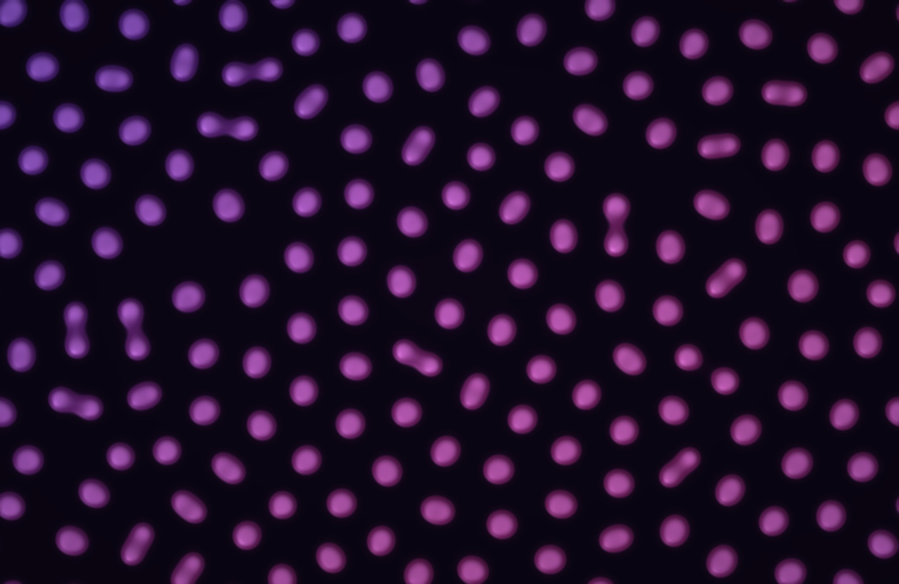

# Turing Patterns

Reaction–diffusion: two chemicals spread across the screen at different rates while one feeds on the other. That's how Alan Turing proposed, in 1952, that spots and stripes form in living things, and it's been seen since in real chemistry and on animals. Patterns grow out of a few glowing seeds and fill the screen in about 20 seconds. Drift (the default) then slowly moves the chemistry round four kinds of pattern: coral branches, cells dividing into spots, spots swelling into a honeycomb of holes, then fingerprint stripes. Every one of them settles into a steady state, so Motion keeps disturbing it. Regrow (the default) dissolves soft patches that grow back in; Flow carries the whole pattern on a slow, swirling current. They're drawn as a softly lit relief, like brain coral, in two jewel tones: glowing on dark in Dark Mode, glazed ceramic on paper in Light Mode.

- **Files:** `Sources/Atrium/TuringPatterns.swift` holds the `TuringPatterns` scene and its shader. `frameTime` comes from Fireflies.swift.
- **Entry:** `@MainActor func turingPatterns(size:)`. Registry entry: icon `circle.hexagongrid.fill`, tint `.mint`, palettes under `turing.palette`.
- **Kind:** a simulation on the CPU, feeding an `SKMutableTexture` with one texel per cell and linear filtering. A shader on one full-screen sprite smooths, lights and colours it.

## How it works
1. **Model.** Gray–Scott, with the constants from Karl Sims' reaction–diffusion tutorial:
   - chemical A diffuses at 1.0 and B at 0.5, over a 3×3 Laplacian (centre −1, sides 0.2, corners 0.05), with a time step of 1;
   - `A' = A + ∇²A − AB² + f(1 − A)` and `B' = B + 0.5∇²B + AB² − (k + f)B`.
   - The feed rate `f` and kill rate `k` pick the kind of pattern.
2. **Grid.**
   - One cell per 5 pt: 303 × 197 cells at 1512×982, centred.
   - Arrays carry a one-cell border, and `wrap()` copies the far edges into it before each step, so the board wraps and the inner loop has no branches.
   - `a`/`b` and `nextA`/`nextB` swap each step.
3. **Seeds.**
   - `seed()` drops a disc 11 cells across of A = 0.5, B = 0.25 ± 0.01. Much smaller, and most seeds die out before they react (3×3 seeds left four of five patterns blank). The noise breaks the disc's symmetry. More than that, and it shows as mottling in the lighting while the seed is young; square seeds showed as squares for their first second.
   - One seed per 800 cells, about 75 at load.
   - If B's peak ever falls below 0.05 (the pattern died), `upload()` reseeds. No pattern here should die, so it's only a guard.
4. **Speed.** 60 steps a second times Speed, counted from `frameTime` and capped at 12 steps a frame, so it looks the same at 15, 30 and 60 fps.
5. **Patterns** (`patterns`, f and k from Pearson, "Complex Patterns in a Simple System", Science 1993, and Sims):

   | Pattern | f | k | Looks like |
   |---|---|---|---|
   | Coral | 0.0545 | 0.062 | thick branching labyrinth |
   | Spots | 0.0367 | 0.0649 | cells that divide (Sims' "mitosis"), settling into a lattice |
   | Holes | 0.039 | 0.058 | a honeycomb, the inverse of spots |
   | Fingerprint | 0.029 | 0.057 | thin parallel stripes |

   

   Only calm, settling kinds made the list. Pearson's travelling waves and spirals (low f) are too busy. Worms (f 0.078, k 0.061) barely grew from seeds and was dropped.
6. **Drift** (`drifting()`).
   - Holds each pattern for its `hold` (Coral and Holes, Dave's favourites, 3 minutes each; Spots and Fingerprint 1), then eases f and k into the next over `ease` = 2 minutes, in list order, looping.
   - The loop is 16 minutes at normal speed. It starts at a random point on the loop, so each load differs.
   - A 16-minute numpy run of the same equations checked every leg: coverage never fell below 28%. The neighbours in the list were ordered so each straight leg stays inside the pattern-forming region.
7. **Motion.** Each pattern settles into a steady state within a minute or so; then nothing moves except while Drift eases between patterns. Measured on the raw field (numpy, Coral), a settled pattern changes 0.017 levels per 1/15 s. Motion keeps it going.
   - **Regrow** (`regrow()`, the default). Every 5 s a soft patch somewhere (a Gaussian bump, σ 14 cells, about 70 pt across) raises the kill rate by up to 0.02, over 4 s up, 6 s held and 6 s down. The pattern there dissolves, then grows back in from the edges with a new shape, as zebrafish regrow their stripes after an injury. About three patches are active at once. The `kill` array is rewritten every 15 steps, and only inside each patch's box. It keeps each pattern's character: coral regrows branches, holes bubble back, and spots divide into the gap.
   - **Flow** (`flow()`). A current carries both chemicals. It comes from a stream function of three board-sized waves, (1,1), (2,1) and (1,2), whose phases drift at 0.00011, −0.00007 and 0.00009 rad a step, so it swirls and wraps with the board. Its peak is 0.012 cells a step, about 3.6 pt/s. It's recomputed every 60 steps, with each wave split into row and column parts (no per-cell trig). Advection uses central differences on neighbours the Laplacian already reads; that's stable because the cell Péclet number is about 0.01. Over a minute or two it combs any pattern into flowing, fingerprint-like whorls, so coral stops looking like coral.
   - **Still** is the original behaviour.
   - Tried and dropped: stronger flow (0.03–0.06 cells a step combed everything into diagonal stripes within 30 s); softer local nudges of k (±0.004–0.007: too subtle, and on Holes a negative nudge left grey fog patches); and **Waves**, f varying across the screen in a travelling band (only 4× the still baseline, as change happened in one band).
8. **Upload.** B × 2, clamped, as 16 bits split across red (high byte) and green (low byte). Linear filtering interpolates both channels, and the sum is still exact, so the smooth reads don't band.
9. **Shader.**
   - **Smoothing.** A cubic B-spline between cells in four linear taps (GPU Gems 2, ch. 20), as in Game of Life's Calm look.
   - **Lighting.** Height is the field. The normal comes from Metal's `dfdx`/`dfdy` (see Gotchas) × 28, lit from the upper left, with a soft sheen.
   - **Colour.** The body edge is `smoothstep(0.25, 0.45)`, running from 55% ink at the edges to ink mixed 35% toward the glow on the ridges. Two inks blend by a slow sine over position and `u_now`.
   - **Dark Mode** adds a faint glow in the gaps, a background of ink × 0.1, and a vignette.
   - **Light Mode** uses warm paper tinted 6% by the ink, ink at 90%, and a glow halfway to white.

## Time and appearance
- The simulation runs on `frameTime`, and the ink drift runs on `u_now`.
- Dark and Light looks are picked from `systemIsDark` when the scene is built.
- Each load starts from fresh seeds, with a random palette unless one is pinned and a random point on Drift's loop.

## Settings

| Key | Label | Range | Default | Notes |
|---|---|---|---|---|
| `turing.pattern` | Pattern | Drift, Coral, Spots, Holes, Fingerprint | Drift | live; a pick reshapes the pattern over the next half minute or so |
| `turing.motion` | Motion | Regrow, Flow, Still | Regrow | live; switching away clears the patches or the current |
| `turing.speed` | Speed | 0.25–3× | 1× | live; scales the steps a second, and so Drift's loop too |
| `turing.palette` | Colors | Lagoon, Sapphire, Amethyst, Jade, Garnet, Amber | Random | rebuilds; swatches show both inks and the glow |

## Tuning constants
- `cell` 5 pt, `stepsPerSecond` 60, a 12-step cap per frame. Drift holds of 3, 1, 3 and 1 minutes, with a 2-minute `ease`.
- Regrow: a patch every 300 steps lasting 960, σ 14 cells in a box of radius 42, kill up to +0.02. Flow: peak 0.012 cells a step, refreshed every 60 steps.
- Seeds: discs of radius 5, 1 per 800 cells, A 0.5, B 0.24–0.26. Reseed below a peak B of 0.05.
- Shader: body 0.25–0.45, ridge 0.45–0.8, normal scale 28, diffuse 0.55 + 0.6·(n·l), sheen power 16 at 0.18, gap glow 0.08, vignette 0.3, ink sine 0.01 rad/s.

## Performance
Measured at CPU 0.9–1.05 ms and GPU 0.3–0.75 ms per frame (release build, 2x, 2026-09-26). GPU cost rises with how much of the screen is pattern. The CPU cost is one step (about 60k cells) per frame at 60 fps, or two at 30 fps: roughly 0.45 ms a step. Faster Speed costs CPU in proportion. At 1× that's about 27 ms of CPU a second (under 3% of one core); at 3× it's about 1.4 ms a frame at 60 fps, or 2.7 ms at 30 fps, which is over budget.

Debug builds are much slower (about 29 ms of CPU a frame in `swift test`), as the unsafe-buffer loop isn't optimised; build.sh builds release.

With Motion, a frame at 30 fps (2 steps) costs about 1.1 ms of CPU with Regrow and 1.35 ms with Flow. The step loop always reads the kill and current arrays, which are zero when unused.

**Busyness** (rendered frames 1/15 s apart, average grey-level change per pixel, 90 s in, never a jump): Still 0.03, Regrow 0.07 on Coral, 0.11 on Holes and 0.05 on Spots, and Flow 0.21. That's against 0.22 for Game of Life's Calm look and 1.41 for Classic. Regrow's change is local (a few patches at a time), so these averages undersell how visible it is.

## Gotchas and shortcuts
- **`dFdx` doesn't exist in SKShader.** SpriteKit's translator doesn't map GLSL's `dFdx`/`dFdy`, and the shader fails to compile ("did you mean 'dfdx'?"). Metal's `dfdx`/`dfdy` pass straight through and work.
- **Seed size:** see How it works. Anything smaller than about 9 cells across dissolves.
- `ponytail:` the simulation is plain scalar Swift on the main thread. If Speed at 3× or a smaller `cell` ever matters, the loop vectorises (it's branch-free over contiguous rows) or can move to a Metal compute pass.

## Dave's feedback and decisions
- 2026-09-26: suggested as a calmer relative of Game of Life, after he found Life "so crazy on the eyes". He asked for it as its own wallpaper, or as a sub-option of Game of Life if that fitted better. It's its own wallpaper, because it shares no code or settings with Life, and Shuffle and the menu treat each wallpaper as one unit.
- 2026-09-26, first look: "really cool but it seems like once the animation settles in and completes it done moving." He enjoyed the growing, and it stopped once growth finished, so Regrow brings growth back and is the default. Flow and Still stay as choices, as he likes to have them. His Game of Life verdict the same day was to keep both looks as a choice.
- "coral and holes are my favorite modes, all are good": Drift now holds Coral and Holes for 3 minutes each, and the others for 1.

## Ideas / next steps
- **Real references:** colour and relief after real Turing patterns (pufferfish skin, brain coral, a zebra's or angelfish's stripes).
- **Scale:** a pattern-size setting (the cell size; it needs a rebuild).
- **Local variety:** vary f and k across the screen so regions show different patterns (the Waves test above, with more amplitude and a still map rather than a travelling one).

## Checking it
`SNAPSHOT_SCENE="Turing Patterns" SNAPSHOT_SECONDS=40 SNAPSHOT_DEFAULTS="turing.pattern=1,turing.palette=Amber" swift test`: pattern 1–4 in the order above, or 0 for Drift. Under 20 seconds it will still be filling in. Check both looks with `SNAPSHOT_APPEARANCE=light|dark`. To explore rates quickly, a numpy copy of the same update (`np.roll` for the Laplacian) runs 3,600 steps of the full grid in about 1.5 s.
