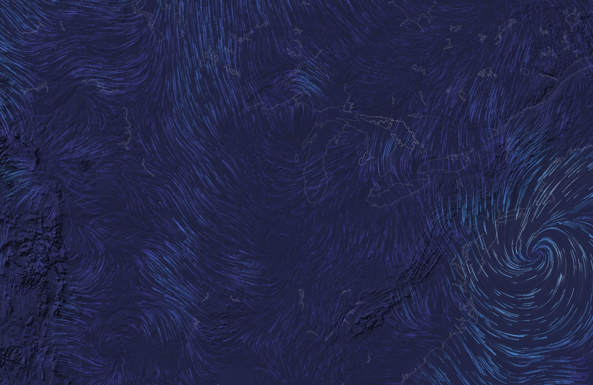

# Wind

The live wind around you, drawn as thin streaks streaming across the map, in the spirit of the hint.fm wind map and earth.nullschool. The streaks follow the real 10 m wind from Open-Meteo, speed up and brighten where it blows harder, crowd together where it converges, and curl round lows. They're brush strokes that stop and fade where they lie, like hint.fm's (the default), or comets with long tails, like nullschool's. The map is Natural Earth's coastlines and lakes, or its shaded relief, or nothing.

- **Files:** `Sources/Atrium/Wind.swift` holds the scene and its shader (`WindScene`), the data (`WindField`) and the map (`WindMap`). `Resources/wind-coast.bin` and `Resources/wind-relief.bin` are the map data. The test is `Tests/AtriumTests/WindTests.swift`.
- **Entry:** `wind(size:)` builds `final class WindScene: SKScene`. Its entry in Scenes.swift is "Wind", icon `wind`, tint `.cyan`, with `WindScene.knobs` and a `PaletteChoice` on `wind.palette` (standard Midnight).
- **Kind:** one full-screen shader at half resolution over a map drawn once. No particles on the CPU.

## How it works
- **The wind field.** `WindField.shared` asks Open-Meteo for the hourly 10 m wind at a grid of 24 × 16 points, 1.2 screen widths across and 0.8 up, centred on you, in one request (a comma-separated list of coordinates; the reply is an array in the same order).
  - `texels(zoom:at:)` blends the two forecast hours either side of now, turns "from" directions into east and north components, and upsamples the grid with Catmull–Rom to a 93 × 61 RGBA texture (`SKMutableTexture`, linear filtering): east in red, north in green, 0.5 for calm and ±1 for `vmax`, the strongest wind anywhere in the forecast, so the encoding never changes between hours. Bilinear from the raw grid put visible kinks in the streaks at every grid line.
  - The scene refreshes the texture every 5 s, so the field eases from hour to hour instead of jumping when a new reply lands.
- **The map's projection** is a local plate carrée at the forecast grid's centre: x = R·cos(lat₀)·Δlon, y = R·Δlat, with the zoom's span across the screen's width. The map is drawn at the grid's centre (from the reply), not at `Location.shared`, so wind and coastline always agree.
  - `ponytail:` plate carrée stretches shapes east–west away from the centre latitude, about ±15% at the continent zoom. An orthographic projection would fix it, but wind vectors would then need rotating to screen north.
- **The streaks** (`source`) are stateless particles, a take on oriented line integral convolution (Wegenkittl & Gröller's OLIC, animated):
  - Streaks start from spots on a lattice of 5 pt cells, turned 23° so it lines up with no wind. `noise`, a 256² texture of random bytes read unfiltered, says which cells have a spot (18% of cells at the default Density), where it sits in its cell, and its phase.
  - Each spot sends a streak downstream once a `period` (5 s for comets, 9 s for strokes, at the default Streak length).
  - **Comets** live `life` = 4.5 s, and their whole tail fades as they die (nullschool). **Brush strokes** travel for 0.9–3 s (random per spot), then stop, and the stroke fades where it lies with the same 2 s time constant (hint.fm, whose particles live 0.04–1.6 s against a 2 s fade). Strokes are nearly even along their length and look combed; comets are bright-headed. The only difference in the shader is whether the particle had to be alive when it passed this pixel, or still be alive now.
  - Each pixel walks up to 64 steps of 0.8–1.5 pt **upstream** along the wind, adding up the time the air takes to reach it (`tau`). When the walk passes within a point of a spot, that spot says when its latest streak's head went past this pixel, and the pixel glows by how recently: `exp(−a / trail)`.
  - **Film:** each passing streak also leaves a faint film, `exp(−a / 6 trail)` at 6%, where streaks have been. Both references get this by accident, from fading in 8 bits (their trails never quite clear), and it's much of their combed texture.
  - The distance from a spot to the walk is measured exactly, to the segment between two steps, so lines are 1 pt wide and anti-aliased. A spot keeps more than half a step plus a line's width from its cell's edges, so a walk can never miss one.
  - Streaks speed up, stretch and bend exactly with the wind, since `tau` is the real travel time along the real streamline.
  - They fade in over their first 0.4 s, fade out toward the end of their life, and fade out before their travel outruns the 96 pt walk (`reach`), so none pop.
- **Colour** comes from the palette's four stops, calm to strong, at √(speed / max(vmax, 8 m/s)), so a calm day still spans the palette, as hint.fm scales to the day's maximum. The strongest stop is pale, so fast air goes toward white, as in both references.
- **Brightness** runs from 40% in calm air to 100% at half the day's strongest wind (max(vmax, 8 m/s)), as hint.fm's saturates, so every day has highlights. An earlier version peaked at 44% luma and had none, the biggest gap the reference agent measured.
- **Speed on screen** depends on the zoom (`u_pace`): 1 m/s is 14 pt/s at the town zoom, 8 at the region and 5 at the continent, times the Speed setting. nullschool's ratio is 1 : 2.4 : 6.4 for the same three; at 5 pt/s everywhere a town looked frozen (330× real time).
- **Crowding:** real particles pile up where the wind converges and thin out where it spreads, which draws hint.fm's bright convergence lines. Stateless streaks can't pile up, so the shader brightens where the field's divergence (over ±20 pt) is negative and dims where it's positive.
- **Half resolution:** the streaks render into an `SKEffectNode` scaled up 2×, with its child at half size. An effect node renders its children at their own scale, so the shader runs once per point, not per Retina pixel. That cut the GPU cost 4.5× (5.0 → 1.1 ms in the first version), and 1 pt lines barely soften.
- **The map** (`WindMap`) is drawn once per zoom, background or location:
  - **Coastline:** Natural Earth 1:10m coastlines, lakes, and its North America and Europe lake supplements, as 0.9 pt lines (white at 25% on dark, grey at 28% on paper), drawn over the streaks as nullschool does, so the map isn't buried. Lakes under 20 pt across are skipped, since hundreds of Canadian lakes cluttered the continent zoom.
  - **Shaded relief:** Natural Earth 1:10m shaded relief (SR_HR) as light and shade on the background colour (`reliefSource`: grey 205 is level ground or water), plus the coastline at 0.7 pt. Neither reference has relief; it stays within a few percent of the ground's brightness so the streaks lead.
  - The background colour is a sprite, not `backgroundColor`, because `SKRenderer` in the tests ignores `backgroundColor`.

## Data files
Both were prepared by a research agent (scripts in its scratch folder: `coast.py`, `relief.py`).
- **`wind-coast.bin`** (3.9 MB): records of an Int32 count n, a Float32 bounding box (west, south, east, north), then n × Float32 (lon, lat). It holds ne_10m_coastline and ne_10m_lakes plus ne_10m_lakes_north_america and ne_10m_lakes_europe (one duplicate removed: the base file's "Lago di Bracciano" is really Bolsena), simplified by Douglas–Peucker at 0.002° and cut into chunks of at most 256 points so the boxes cull well. At 0.001° it was 4.1 MB and looked the same.
- **`wind-relief.bin`** (5.8 MB): SR_HR (21600 × 10800, 60 px a degree) median-filtered 3 × 3, cut into 15° tiles stored as greyscale HEIC at quality 50. A header of four Int32 (15, 24 columns, 12 rows, 60) and an Int32 offset and length per tile from the north-west; 60 all-ocean tiles have length 0. The ocean is exactly 206; flat land 202–207; relief runs 56–252, lit from the north-west. JPEG tiles (9.5 MB at q75) showed their 8 × 8 blocks as faint boxes once magnified at town zoom; HEIC's deblocking filter removes them at the same size.

## Time, live data and appearance
- **Open-Meteo** (`https://api.open-meteo.com/v1/forecast?latitude=…&longitude=…&hourly=wind_speed_10m,wind_direction_10m&past_hours=1&forecast_hours=12&wind_speed_unit=ms&timeformat=unixtime&cell_selection=nearest`), free, no key, CC BY 4.0. `best_match` picks the finest model for the place: NCEP HRRR (3 km) in the US, UKMO, AROME, ICON-D2 or MET Nordic (1–2 km) in much of Europe, ICON and GFS elsewhere.
  - **Cost:** each point is one call against the free 10,000 a day (and 600 a minute, 5,000 an hour), however many hours it asks for, up to 10 variables. 384 points every two hours is at most 4,600 a day, alongside Earth from Orbit's storms (~1,300) and the shared weather (~96). Hourly would be 9,200, too close to the limit. The 12-hour forecast means polling every two hours loses nothing but a model update.
  - **Polling:** an SKAction every 5 minutes (so it stops while the wallpaper is hidden) calls `poll(zoom:)`, which fetches when the cached reply for that zoom is two hours old or you've moved more than a grid spacing, at most every 10 minutes whatever asks. One fetch serves every display and the Settings preview.
  - **Cache:** the raw reply for each zoom is kept in `~/Library/Caches/com.dtanquary.atrium/wind-<zoom>.json`, so the wind shows at once, offline or after a relaunch. Offline for more than 12 hours, it holds the last forecast hour.
  - `cell_selection=nearest` samples the model's grid regularly; the default (`land`) wanders ±0.015° to match elevation.
  - The request is a 6 KB URL, which Open-Meteo takes as a GET.
- **Offline default:** before any reply, a made-up breeze with a low to the north-east, centred on you.
- **Location:** `Location.shared.start()` in `didMove`.
- **Appearance:** Dark Mode is lines of light over a dusky ground tinted by the palette's calmest colour (about 10% luma: both references sit on a lifted graphite, and pure black looked harsh); Light Mode is the same streaks as ink on paper (each stop's hue at full strength, deeper where it's windier), after hint.fm. Checked with `SNAPSHOT_APPEARANCE=light|dark`.

## Settings
All live, except Palette, which rebuilds. Zoom and Background redraw the map; a new zoom fetches its own grid.

| Key | Label | Range | Default | Notes |
|---|---|---|---|---|
| `wind.zoom` | Zoom | My town, My region, Half the continent | My region | 100, 800 and 3,500 km across the screen |
| `wind.background` | Background | None, Coastline, Shaded relief | Coastline | Dave asked to compare the three |
| `wind.look` | Look | Comets, Brush strokes | Brush strokes | nullschool's comets or hint.fm's strokes, to compare |
| `wind.speed` | Speed | 0.25–4× | 1× | only changes how fast `u_clock` runs, so the picture stays the same and nothing jumps |
| `wind.length` | Streak length | 0.25–2× | 1× | the tail's time constant, 2 s × this; a streak lives 2.25 × that |
| `wind.density` | Density | 0.1–1 | 0.6 | the share of lattice cells with a spot, × 0.3; 0.4 was calmer but half as dense as the references |
| `wind.palette` | Colors | Midnight, Sapphire, Lagoon, Amethyst, Garnet, Silver, Random | Midnight | four stops, calm to strong |

**Speed on screen:** at 1× a 5 m/s breeze moves 70 pt/s at the town zoom (about 920× real time), 40 pt/s at the region (4,200×) and 25 pt/s at the continent (11,600×). hint.fm moves a 5 m/s wind about 80 pt/s at every zoom (scaled to this screen), nullschool 33–210 px/s; this is slower, for calm.

## Tuning constants
- Lattice 5 pt, turned 23°, margin 0.28 of a cell; presence 0.3 × Density.
- Walk: 64 steps of `clamp(speed × 0.06, 0.8, 1.5)` pt, the field read every other step; `reach` 96 pt. Pace 14, 8, 5 pt/s per m/s by zoom.
- Comets: tail `2 s × Streak length`, life 2.25 × tail, period life + 0.5. Strokes: travel 0.3–1 of 1.5 × tail, period life + 3 tails. Periods are rounded so they divide an hour, where `u_clock` wraps.
- Line 0.25–0.85 pt from the walk; brightness 0.55–1 by spot; film `exp(−a / 6 tail)` at 6%.
- Glow `(1 − exp(−2.2 × sum × (1 + 0.8 × crowd))) × (0.4 + 0.6 × fast) + 0.06 × film`, fast = speed / (0.5 × max(vmax, 8)), capped at 1.
- Background: `stops[0] × 0.2 + 0.055` in Dark Mode; paper (0.955, 0.953, 0.94) tinted 4% toward stop 1.

## Performance
Release build, 2x, 1512×982, measured 2026-09-26 in paired runs with Nebula (whose documented cost is 1.6 ms): **CPU 0.45–0.6 ms, GPU about 1.6 ms**, level with Nebula (1.66–1.80 against its 1.76–1.86 in the same runs), across the zooms, looks and backgrounds. Before the film, highlights and brush strokes it was 1.16–1.35 ms. Almost all of the GPU time is the walk; the texture reads are about a fifth of it, and the cost scales with the number of steps (40 steps cost 1.86 ms at full density in an early version, 20 cost 0.91), so 48 steps is the first cut if it needs one. The map costs nothing per frame. The field texture is rebuilt every 5 s on the CPU (93 × 61 Catmull–Rom samples, well under a millisecond), and the map when the zoom, background or place changes: the coastline is a loop over 8,500 records, the relief a decode of 2–6 HEIC tiles.
- Rendering the streaks at full Retina resolution cost 4.5× as much.
- Memory: the two data files are memory-mapped (9.7 MB); the relief texture is 1.5 MB.

## Gotchas and shortcuts
- **SKRenderer ignores `backgroundColor`,** so a scene that relies on it renders black in the tests. The background is a sprite.
- **Don't fetch from `init`.** Settings are applied in `init`, and the first version polled there too, so every render test fetched from Open-Meteo at the tests' guessed location and wrote it into the app's shared cache (`~/Library/Caches`), which put the map in the wrong place until the next fetch. It polls only while in a view now.
- **GPU timings are noisy while other sessions run tests:** calibrate against a scene with a known cost (Nebula) in the same run.
- **Stateless streaks don't pile up** where the wind converges, as real particles do; the divergence brightening stands in for it.
- **The grid is coarse next to nullschool's global model** (about 180 km apart at the continent zoom against GFS's 25 km), so fronts and mountain eddies are smoother than theirs. Open-Meteo's free calls are the limit.
- `ponytail:` plate carrée, see above.

## Research: the reference maps
Two research agents, 2026-09-26: one on the look of the reference maps (reading hint.fm's bundle and nullschool's live source, with screenshots), one on the data.
- **earth.nullschool:** about 9,000 particles per 1000 × 1000 px, 1 px lines, trails fading ×0.97 a frame (half-life 0.9 s), particles living 100 frames; grey #555 at 0 m/s to white at 15 m/s under a speed-coloured overlay at 44%; coast and lakes white at 65%, 1.25 px; background #303030.
- **hint.fm** (still live): 5,000 particles over the lower 48 (about 21,500 per million px of land), lives of 1–41 frames, 0.75 px strokes, fade ×0.98 a frame (half-life 1.4 s) that never quite clears in 8 bits and leaves a faint permanent "fur"; grey 90 + 350 × speed / the day's max; the US as a silhouette on white, no relief. Beautiful at full-US scale; zoomed in it turns to sparse dashes like rain.
- **What followed:** both are dense (streaks cover about a third of the map), thin, calm-dim and bright-fast, with bright convergence lines. The first version here, one spot per 24 pt cell, was a tenth as dense, so the lattice went to 5 pt. Two other techniques were tried and dropped:
  - Advecting noise with a two-phase flow map and integrating it along the wind: dense and cheap, but the flow map shears the noise wherever the wind curves, so round a low the streaks became wide brush strokes with a herringbone texture.
  - Gaussian dots in a texture: 3 pt streaks with stippled edges, against the references' 1 px lines.
- Side-by-side sheets of the references and renders are in the research scratch folder (`compare/`).
- **Measured** the agent's way (the share of pixels brighter than the ground by 20 grey levels, and the brightest 0.1%): nullschool 21% (continent) to 48% (region), hint.fm 39–50% with highlights near 230/255. Here, at the defaults, 10–12% with highlights at 150 in Midnight, and 12% with highlights at 180 in Silver, the like-for-like grey. So it's still about a third as much ink as hint.fm: calmer on purpose, and blue ink counts for less in luminance than grey. Density 1 roughly doubles it.

## Dave's brief
2026-09-26: "the live wind around me drawn as slow, flowing streaks, in the spirit of the hint.fm wind map and earth.nullschool". Open-Meteo, a grid plus the hourly forecast, blended hour to hour, polled about hourly within the free tier, cached for offline; the field in a mutable texture and a shader moving noise along it, no CPU particles; jewel-toned palettes by speed; speed, streak length, density and zoom (town, region, half the continent); and backgrounds to compare as a Settings choice: none, a faint coastline, dim shaded relief. "It's data art rather than photoreal, so the bar is 'as beautiful as the reference maps'."
- **Decided:** polling every two hours for a 24 × 16 grid instead of hourly for 16 × 10, since the denser grid shows clearly more real structure (eddies, fans over the plains, faster wind over Lake Michigan) and the forecast covers the gap. Revert by changing `cols`, `rows` and the 7000 s in `poll`.
- **The reference agent's review** of the first renders (measured: 11–13% of pixels lit against 21–50%, no highlights, a near-black ground) led to the highlights, the film, the lifted ground, the pace by zoom, the coastline on top and the Brush strokes look.
- **Next:** Dave compares the three backgrounds and the two looks live, then keep one of each, or several, as a choice.

## Ideas / next steps
- **Town-zoom relief:** Natural Earth's relief is magnified 28× there and turns to mush. AWS Open Data's Terrain Tiles (Mapzen terrarium PNGs, `s3.amazonaws.com/elevation-tiles-prod/terrarium/{z}/{x}/{y}.png`) give about 15 z10 tiles (1–1.5 MB per place, cached forever) that shade sharply, e.g. Denver's Dakota Hogback and creek valleys. They need an attribution line for their mixed sources (USGS 3DEP, SRTM, GMTED2010, ETOPO1, EU-DEM, and others) and a vertical exaggeration of about 2 to match Natural Earth.
- **A live status line** in Settings, like Weather's ("Live: 12 km/h from SW · updated 3:05 PM"), once `StatusRow` can show under an ungated row.
- **A nullschool-style overlay:** a faint jewel wash of wind speed over the background.
- **Crossfade** on a zoom change, as Weather does on a new forecast.
- **Rivers and borders** from Natural Earth for inland places with no coast (Kansas City has no water in 400 km at 1:10m).

## Checking it
- `SNAPSHOT_SCENE=Wind swift test` renders the cached wind for the region zoom (or the made-up breeze); add `SNAPSHOT_DEFAULTS="wind.zoom=2,wind.background=2"` for the continent over relief, and `SNAPSHOT_APPEARANCE=light`.
- `swift test --filter parsesWindGrid` checks the grid order, directions and centre.
- `SNAPSHOT_MOVIE=2` then compare frames: at the continent zoom frames change by 0.58 grey levels on average, with 0.18% of pixels jumping more than 40 (Game of Life's Calm look is 0.22).
- To see the live data: `ls -la ~/Library/Caches/com.dtanquary.atrium/wind-*.json`, and the grid's first point with `python3 -c "import json;print(json.load(open('$HOME/Library/Caches/com.dtanquary.atrium/wind-1.json'))[0]['hourly'])"`.
